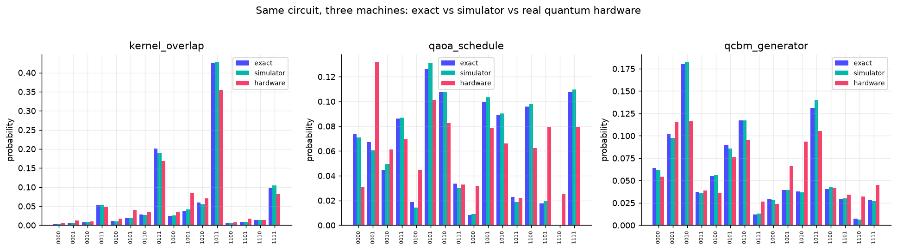
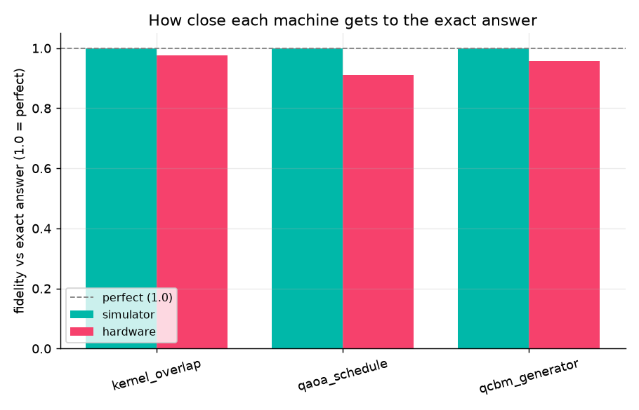

# Quantum Healthcare Hardware Check

**The first project ran on a simulator. This one runs on a real quantum computer.**

I took the three healthcare tests from [quantum-healthcare-reality-check](https://github.com/amitchorasiya/quantum-healthcare-reality-check), shrank each one to a single small circuit, and ran it two ways: on a perfect simulator and on a real IBM quantum machine. Then I measured the gap.

> **Why this matters.** A simulator is a perfect quantum computer. Real hardware is noisy. The gap between them is the thing everyone glosses over. This project measures it, in plain numbers.

---

## New to quantum? Read this first

No physics needed.

- **Qubit (quantum bit).** Where a normal computer stores a 0 or a 1, a quantum computer uses a qubit, which can act like a blend of both at once. That is the trick that *might* make some problems faster.
- **Circuit.** A short recipe of steps you run on the qubits, then measure.
- **Gate.** One step in that recipe. A **two-qubit gate** acts on two qubits at once and is the noisiest, most error-prone step. More two-qubit gates means more noise.
- **Simulator vs hardware.** A simulator imitates a quantum computer on a laptop, with no noise, so it gives the exact answer. Real hardware has noise, so its answer drifts. This project measures that drift.
- **Fidelity.** A score from 0 to 1 for how close a machine's answer is to the exact one. 1.0 is perfect.

The circuits come from three tools tested in the first project:

- **Quantum kernel.** A quantum way to measure how alike two data points are.
- **QAOA (Quantum Approximate Optimization Algorithm).** A quantum method for yes/no puzzles, like a schedule.
- **QCBM (Quantum Circuit Born Machine).** A quantum circuit that learns to produce a target pattern. A quantum "generator."

---

## The question

Same circuit. Three machines. How close does each get to the exact, known answer?

1. **Exact.** Statevector math. The ground truth. No sampling, no noise.
2. **Simulator.** A local sampler with real shot counts. Sampling noise only.
3. **Hardware.** A real IBM quantum computer. Sampling noise plus device noise.

We score each run with two numbers against the exact truth: total variation distance (lower is better) and Hellinger fidelity (1.0 is perfect).

---

## The three circuits

Each one is a tiny, frozen version of an original experiment. Small on purpose, so it fits the free IBM trial budget and runs in one job.

| Circuit | From | What it shows |
|---|---|---|
| `kernel_overlap` | Test 1 (quantum kernel) | One quantum-kernel entry. The chance of measuring all zeros *is* the kernel value. Noise corrupts it. |
| `qaoa_schedule` | Test 2 (QAOA, Quantum Approximate Optimization Algorithm) | The best state for a tiny nurse-scheduling puzzle. Should peak on one answer. Noise smears the peak. |
| `qcbm_generator` | Test 3 (QCBM, Quantum Circuit Born Machine) | A small quantum generator's output. Noise distorts what it "generates." |

---

## Results

### Simulator vs exact (done)

The shot-based simulator lands right on top of the exact answer. The only gap is sampling noise from a finite number of shots.

| Circuit | Fidelity vs exact | Total variation distance |
|---|---|---|
| kernel_overlap | 0.9994 | 0.018 |
| qaoa_schedule | 0.9988 | 0.022 |
| qcbm_generator | 0.9996 | 0.017 |

### Hardware vs exact (done, on `ibm_fez`)

Real quantum hardware drifts well below the simulator, and the pattern is exactly what theory predicts: the deeper the circuit, the worse the drift. The QAOA circuit has the most two-qubit gates, so it lost the most. The kernel overlap is shallowest, so it held up best.

| Circuit | Two-qubit gate depth | Simulator fidelity | **Hardware fidelity** | Hardware TVD |
|---|---|---|---|---|
| kernel_overlap (shallowest) | low | 0.9994 | **0.9755** | 0.125 |
| qcbm_generator | medium | 0.9996 | **0.9572** | 0.160 |
| qaoa_schedule (deepest) | high | 0.9988 | **0.9111** | 0.217 |

Ran on **`ibm_fez`**, a 156-qubit IBM Quantum machine, 4096 shots each.




---

## Run it yourself

```bash
python -m venv .venv && source .venv/bin/activate
pip install -r requirements.txt

# one-time: save your IBM Quantum credentials (kept out of git)
python setup_ibm.py --token YOUR_API_KEY --crn "crn:v1:bluemix:..."
python setup_ibm.py --check          # confirm the machines are visible

python run_comparison.py --sim-only  # simulator side (uses the qiskit client)

# real hardware via the REST path (see note below):
export QHRC_IBM_TOKEN=YOUR_API_KEY
export QHRC_IBM_CRN="crn:v1:bluemix:..."
python run_hardware_rest.py          # submits to a real QPU (Quantum Processing Unit), fills in the numbers
python make_plots.py
```

Get your API key and instance CRN from [quantum.cloud.ibm.com](https://quantum.cloud.ibm.com). Credentials save to `~/.qiskit` or come from env vars, never from this repo.

> **Note on the REST path.** On a brand-new IBM Cloud account, the Qiskit client's instance discovery can fail (it cannot enumerate the instance even though the instance works), so `SamplerV2` refuses to submit. `run_hardware_rest.py` talks to IBM's REST (web) API directly with the instance CRN (Cloud Resource Name, the ID of your quantum instance), which works. It sends circuits as QASM3 (Open Quantum Assembly, the text format for a circuit).

## What is in the box
```
ibm_experiments/circuits.py   the three small showcase circuits
ibm_backend.py                connects to IBM Quantum (or reports none)
run_comparison.py             runs exact + simulator + hardware, scores each
make_plots.py                 distribution and accuracy charts
setup_ibm.py                  one-time credential save + connection check
results/                      comparison.json + plots/
```

## The fine print
- **Small circuits only.** Four qubits, one job each. That is what a free trial and a noisy machine allow.
- **Queue time is real.** Hardware jobs wait in line. A run can take minutes to hours.
- **Hardware looks worse, and that is the point.** The simulator scored above 0.998. The real machine scored 0.91 to 0.98, and the deepest circuit lost the most. That gap is the whole lesson.

*An independent project. Not tied to or backed by any company. MIT-licensed.*
